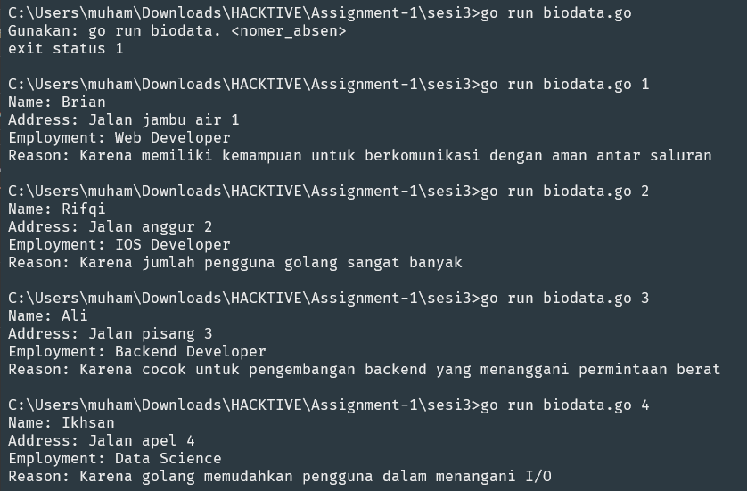
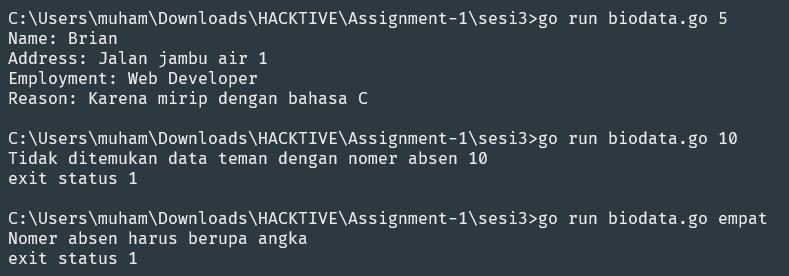

# Assignment 1 - SESI 3

## Instructions

Buatlah sebuah service berupa CLI untuk menampilkan data teman-teman kalian dikelas.Contohnya, ketika kalian menjalankan perintah go run biodata.go 1 maka data yang akan muncul adalah datateman kalian dengan absen no 1. Data yang harus ditampilkan yaitu:

- Nama
- Alamat
- Pekerjaan
- Alasan memilih kelas Golang Gunakanlah struct dan function untuk menampilkan data tersebut

`Kalian bisa menggunakan os.Args untuk mendapatkan argument pada terminal`

## Pengumpulan

Compress folder kode kaliat menjadi file .zip dan upload kepada Google Classroom.

## Output

